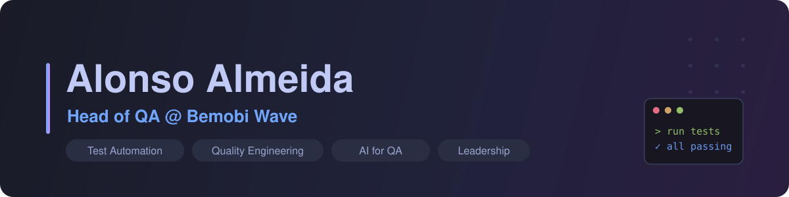

  

<h1 align="center">Hi, I'm Alonso Almeida 👋</h1>

  
  
  

---

### 👨‍💻 About me

QA professional with 4+ years of experience, focused on ensuring software quality through functional and non-functional testing and a strong culture of ownership. I started in software development (HTML5, Java, APIs) and moved into QA, which gives me a solid technical foundation to build reliable, well-tested products.

I've grown from Trainee to QA Lead, leading teams, defining quality strategies, and shaping processes that increased efficiency, reduced defects, and ensured secure, usable deliveries, including regulated work in the financial sector.

- 🔭 Currently focused on **QA leadership**, **test automation at scale**, and **AI-assisted quality engineering**
- 🧪 I live in Playwright + TypeScript, and I'm fluent across the stack when a test needs it
- 🌱 Always leveling up in **systems architecture** and **engineering leadership**
- 🗣️ Native Portuguese, fluent English, and I thrive in multicultural, Agile teams
- 💬 Ask me about **test strategy, CI quality gates, flaky-test triage, and building QA culture**

---

### ⭐ What I'm about

- 🏗️ Built the entire **Software Quality function at Bemobi Wave from the ground up**, and now lead the onboarding and training of every new QA
- 🧰 Created an **in-house test-case management platform from scratch**: plan and run test executions and generate automation artifacts, all driven by **AI applied to QA**
- ⚡ Cut test **mapping and sign-off time by roughly 90%** with AI-assisted workflows (what used to take a full day now takes about an hour)
- 🤖 Turning QA into a data-driven, AI-powered discipline instead of a manual bottleneck

---

### 🛠 Tech & Tools

---

### 💼 Experience

| Role | Company | Focus | Period |
|------|---------|-------|--------|
| **Head of QA** | Bemobi Wave | Test strategy, mobile/web automation, quality metrics | Oct 2024 - Present |
| **QA Project Lead** | FitBank | Team leadership, QA in regulated fintech | Apr 2024 - Oct 2024 |
| **QA Analyst Jr** | FitBank | Manual & automated test design (JUnit, BDD) | Feb 2024 - Apr 2024 |
| **QA Analyst Trainee** | FitBank | Test environments, exploratory testing, defect reporting | Jul 2023 - Jan 2024 |
| **Frontend Developer** | Freelance | Responsive UIs with React.js, HTML5, CSS | Jan 2023 - Mar 2023 |
| **Developer** | Include Jr | HTML5, Java, APIs, Agile delivery | Sep 2022 - Sep 2023 |

---

### 🎓 Education

- **B.Sc. in Software Engineering**, Universidade Federal do Ceará (2021 - 2026)

---

### 📊 GitHub Stats

  
  

  

---

<i>"Quality is never an accident; it is always the result of intelligent effort."</i>

